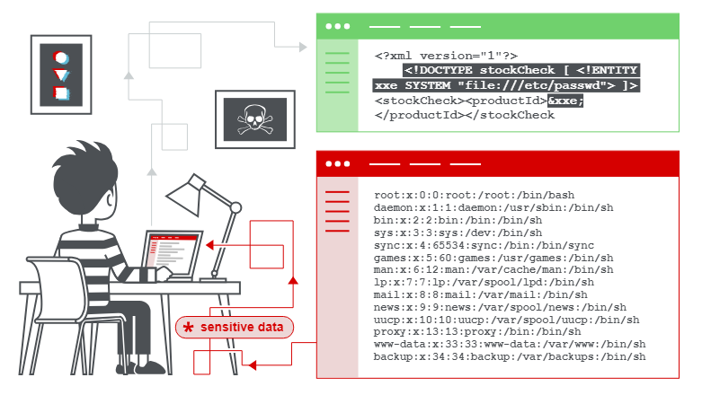
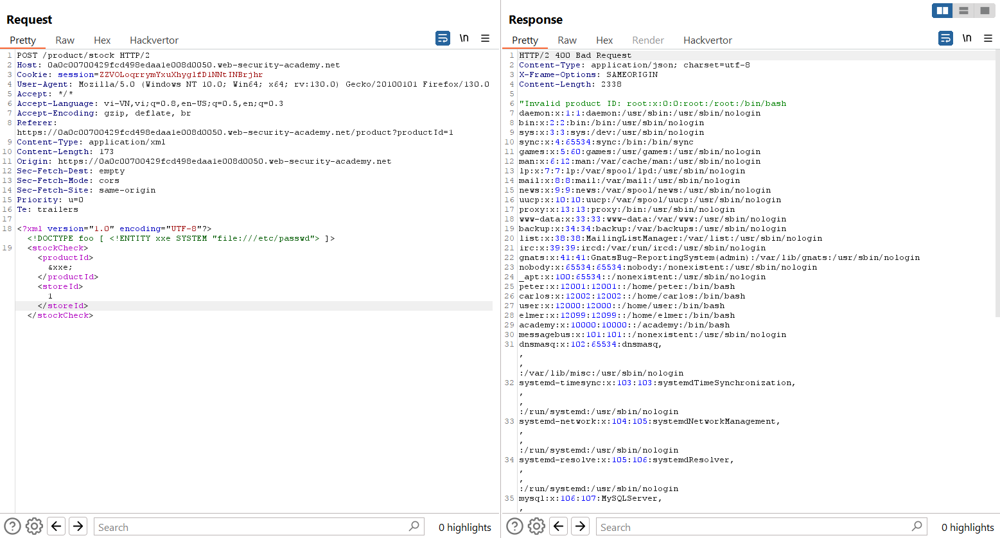
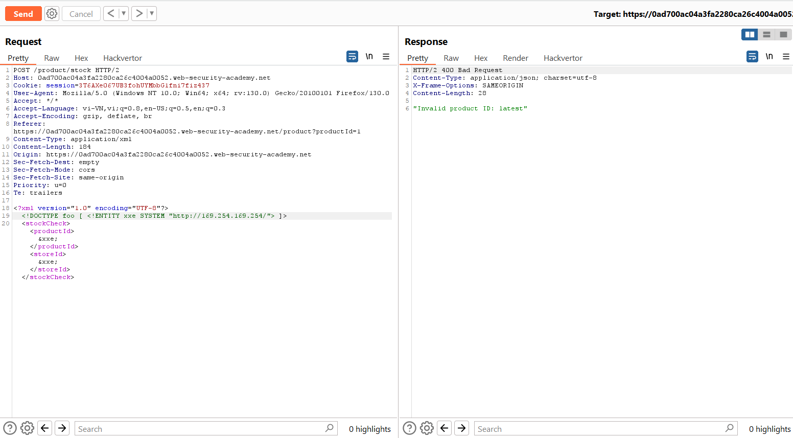
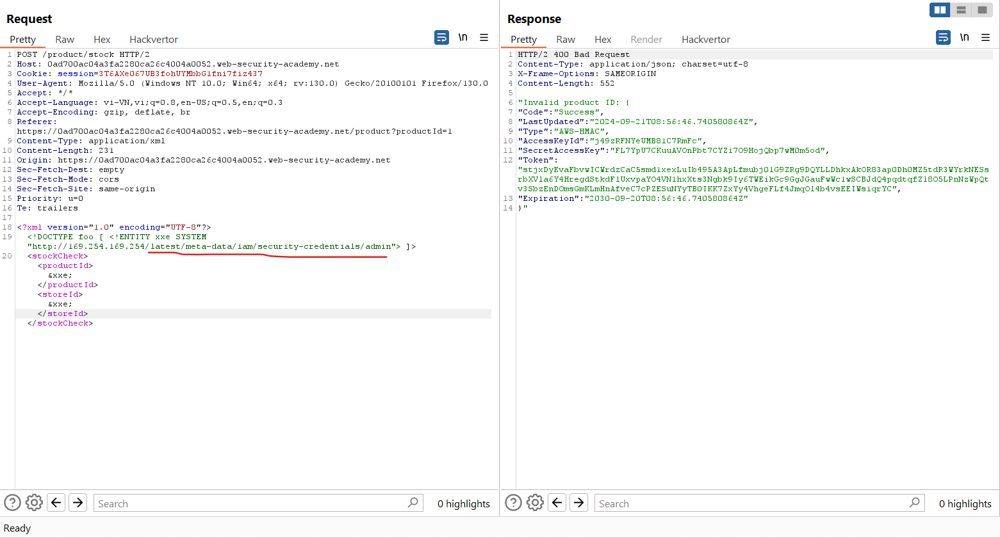

# XML external entity (XXE) injection
Trong phần này, chúng tôi sẽ giải thích XML external entity injection là gì, mô tả một số ví dụ phổ biến, giải thích cách tìm và khai thác các kiểu chèn XXE khác nhau cũng như tóm tắt cách ngăn chặn các cuộc tấn công chèn XXE.
## What is XML external entity injection?
XML external entity injection (còn được gọi là XXE) là một lỗ hổng bảo mật web cho phép kẻ tấn công can thiệp vào quá trình xử lý dữ liệu XML của ứng dụng. Nó thường cho phép kẻ tấn công xem các tệp trên hệ thống tệp của máy chủ ứng dụng và tương tác với bất kỳ hệ thống phụ trợ hoặc bên ngoài nào mà chính ứng dụng có thể truy cập.\
Trong một số trường hợp, kẻ tấn công có thể leo thang cuộc tấn công XXE để xâm phạm máy chủ cơ bản hoặc cơ sở hạ tầng phụ trợ khác, bằng cách lợi dụng lỗ hổng XXE để thực hiện các cuộc tấn công giả mạo yêu cầu phía máy chủ (SSRF).\


## How do XXE vulnerabilities arise?
Một số ứng dụng sử dụng định dạng XML để truyền dữ liệu giữa trình duyệt và máy chủ. Các ứng dụng thực hiện việc này hầu như luôn sử dụng thư viện chuẩn hoặc API nền tảng để xử lý dữ liệu XML trên máy chủ. Lỗ hổng XXE phát sinh do đặc tả XML chứa nhiều tính năng nguy hiểm tiềm tàng khác nhau và các trình phân tích cú pháp tiêu chuẩn hỗ trợ các tính năng này ngay cả khi chúng thường không được ứng dụng sử dụng.\
Đọc thêm [Tìm hiểu về định dạng XML, DTD và các thực thể bên ngoài](<XML entities.md>)\
Các thực thể bên ngoài XML là một loại thực thể XML tùy chỉnh có các giá trị được xác định được tải từ bên ngoài DTD mà chúng được khai báo. Các thực thể bên ngoài đặc biệt thú vị từ góc độ bảo mật vì chúng cho phép xác định một thực thể dựa trên nội dung của đường dẫn tệp hoặc URL.
## What are the types of XXE attacks?
Có nhiều loại tấn công XXE khác nhau:\
- **Exploiting XXE to retrieve files**, trong đó một thực thể bên ngoài được xác định có chứa nội dung của tệp và được trả về trong phản hồi của ứng dụng.
- **Exploiting XXE to perform SSRF attacks**, trong đó một thực thể bên ngoài được xác định dựa trên URL tới hệ thống phụ trợ.
- **Exploiting blind XXE exfiltrate data out-of-band**, nơi dữ liệu nhạy cảm được truyền từ máy chủ ứng dụng đến hệ thống mà kẻ tấn công kiểm soát.
- **Exploiting blind XXE to retrieve data via error messages**, nơi kẻ tấn công có thể kích hoạt thông báo lỗi phân tích cú pháp chứa dữ liệu nhạy cảm.

## Exploiting XXE to retrieve files
Để thực hiện cuộc tấn công chèn XXE nhằm truy xuất một tệp tùy ý từ hệ thống tệp của máy chủ, bạn cần sửa đổi XML đã gửi theo hai cách:
- Giới thiệu (hoặc chỉnh sửa) phần tử DOCTYPE xác định thực thể bên ngoài chứa đường dẫn đến tệp.
- Chỉnh sửa giá trị dữ liệu trong XML được trả về trong phản hồi của ứng dụng để sử dụng thực thể bên ngoài đã xác định.

Ví dụ: giả sử một ứng dụng mua sắm kiểm tra mức tồn kho của sản phẩm bằng cách gửi XML sau tới máy chủ:\
```
<?xml version="1.0" encoding="UTF-8"?>
<stockCheck><productId>381</productId></stockCheck>
```
Ứng dụng không thực hiện biện pháp phòng vệ cụ thể nào trước các cuộc tấn công XXE, vì vậy bạn có thể khai thác lỗ hổng XXE để truy xuất tệp `/etc/passwd` bằng cách gửi tải trọng XXE sau:
```
<?xml version="1.0" encoding="UTF-8"?>
<!DOCTYPE foo [ <!ENTITY xxe SYSTEM "file:///etc/passwd"> ]>
<stockCheck><productId>&xxe;</productId></stockCheck>
```
Tải trọng XXE này xác định một thực thể bên ngoài `&xxe;` có giá trị là nội dung của tệp `/etc/passwd` và sử dụng thực thể trong giá trị `ProductId`. Điều này khiến phản hồi của ứng dụng bao gồm nội dung của tệp:
```
Invalid product ID: root:x:0:0:root:/root:/bin/bash
daemon:x:1:1:daemon:/usr/sbin:/usr/sbin/nologin
bin:x:2:2:bin:/bin:/usr/sbin/nologin
...
```
Note: Với các lỗ hổng XXE trong thế giới thực, thường sẽ có một số lượng lớn giá trị dữ liệu trong XML được gửi, bất kỳ giá trị nào trong số đó có thể được sử dụng trong phản hồi của ứng dụng. Để kiểm tra một cách có hệ thống các lỗ hổng XXE, thông thường bạn sẽ cần kiểm tra từng nút dữ liệu trong XML riêng lẻ bằng cách sử dụng thực thể đã xác định của mình và xem liệu nó có xuất hiện trong phản hồi hay không.

Ví dụ: https://portswigger.net/web-security/xxe/lab-exploiting-xxe-to-retrieve-files



## Exploiting XXE to perform SSRF attacks
Ngoài việc truy xuất dữ liệu nhạy cảm, tác động chính khác của các cuộc tấn công XXE là chúng có thể được sử dụng để thực hiện giả mạo yêu cầu phía máy chủ (SSRF). Đây là một lỗ hổng nghiêm trọng tiềm ẩn trong đó ứng dụng phía máy chủ có thể bị lợi dụng để thực hiện các yêu cầu HTTP tới bất kỳ URL nào mà máy chủ có thể truy cập.\
Để khai thác lỗ hổng XXE nhằm thực hiện cuộc tấn công SSRF, bạn cần xác định một thực thể XML bên ngoài bằng URL mà bạn muốn nhắm mục tiêu và sử dụng thực thể đã xác định trong một giá trị dữ liệu. Nếu bạn có thể sử dụng thực thể đã xác định trong giá trị dữ liệu được trả về trong phản hồi của ứng dụng thì bạn sẽ có thể xem phản hồi từ URL trong phản hồi của ứng dụng và do đó có được sự tương tác hai chiều với hệ thống phụ trợ. Nếu không, bạn sẽ chỉ có thể thực hiện các cuộc tấn công SSRF mù quáng (vẫn có thể gây ra hậu quả nghiêm trọng).\
Trong ví dụ XXE sau, thực thể bên ngoài sẽ khiến máy chủ tạo yêu cầu HTTP back-end tới hệ thống nội bộ trong cơ sở hạ tầng của tổ chức:\
`<!DOCTYPE foo [ <!ENTITY xxe SYSTEM "http://internal.vulnerable-website.com/"> ]>`

Ví dụ: https://portswigger.net/web-security/xxe/lab-exploiting-xxe-to-perform-ssrf

Tương tự bài trên thay nội dung cần đọc:\


Phần `Invalid product ID:` là cố định, `lastest` là path, ta thêm path đó, rồi lần lượt request đến cuối cùng: \


## Blind XXE vulnerabilities
Nhiều trường hợp lỗ hổng XXE bị mù. Điều này có nghĩa là ứng dụng không trả về giá trị của bất kỳ thực thể bên ngoài nào được xác định trong phản hồi của nó và do đó không thể truy xuất trực tiếp các tệp phía máy chủ.\
Các lỗ hổng XXE mù vẫn có thể bị phát hiện và khai thác nhưng cần có các kỹ thuật nâng cao hơn. Đôi khi, bạn có thể sử dụng các kỹ thuật ngoài băng tần để tìm lỗ hổng và khai thác chúng để lấy dữ liệu. Và đôi khi bạn có thể gây ra lỗi phân tích cú pháp XML dẫn đến tiết lộ dữ liệu nhạy cảm trong các thông báo lỗi.


