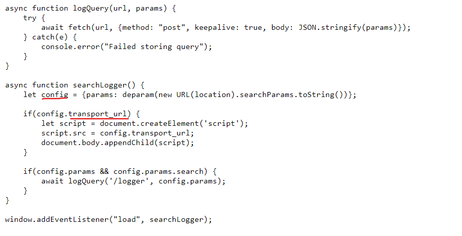

# Client-side prototype pollution vulnerabilities

Trong phần này, bạn sẽ học cách tìm lỗ hổng prototype pollution phía client trong môi trường thực tế. Để củng cố sự hiểu biết về cách các lỗ hổng này hoạt động, chúng tôi sẽ hướng dẫn cách thực hiện thủ công cũng như cách sử dụng công cụ DOM Invader để tự động hóa phần lớn quá trình này. 

## Tìm các nguồn prototype pollution phía client thủ công

Việc tìm nguồn prototype pollution thủ công chủ yếu dựa vào phương pháp thử và sai. Nói ngắn gọn, bạn cần thử các cách khác nhau để thêm một thuộc tính tuỳ ý vào `Object.prototype` cho đến khi tìm được nguồn hoạt động.

Khi kiểm tra các lỗ hổng phía client, quá trình này bao gồm các bước chính sau:

- Hãy thử chèn một thuộc tính tùy ý thông qua chuỗi truy vấn, đoạn URL và bất kỳ đầu vào JSON nào. Ví dụ: `vulnerable-website.com/?__proto__[foo]=bar`
- Trong console của browser, hãy kiểm tra `Object.prototype` để xem bạn đã thành công trong việc làm ô nhiễm nó bằng thuộc tính tùy ý của mình hay chưa: `Object.prototype.foo
// nếu trả về "bar" thì tiêm thành công
// nếu trả về undefined thì tiêm không thành công`
- Nếu thuộc tính không được thêm vào prototype, hãy thử sử dụng các kỹ thuật khác, chẳng hạn như chuyển sang ký hiệu dấu chấm thay vì ký hiệu dấu ngoặc hoặc ngược lại: `vulnerable-website.com/?__proto__.foo=bar`
- Repeat this process for each potential source.

## Tìm nguồn prototype phía client bằng DOM Invader


## Tìm nguồn prototype pollution gadgets phía client thủ công

Sau khi xác định được nguồn cho phép bạn thêm các thuộc tính tùy ý vào `Object.prototype` toàn cục, bước tiếp theo là tìm một gadget phù hợp mà bạn có thể sử dụng để tạo ra một lỗ hổng.
- Xem qua mã nguồn và xác định bất kỳ thuộc tính nào được ứng dụng sử dụng hoặc bất kỳ lib nào mà ứng dụng import vào.
- Trong Burp, hãy bật tính năng chặn phản hồi (`Proxy` > `Options` > `Intercept server responses`) và chặn phản hồi có chứa JavaScript mà bạn muốn kiểm tra.
- Thêm debugger vào đầu tập script, sau đó chuyển tiếp mọi yêu cầu và phản hồi còn lại.
- Trong trình duyệt của Burp, hãy đến trang mà tập lệnh mục tiêu được tải. Câu lệnh debugger sẽ tạm dừng thực thi tập lệnh.
- Trong khi script vẫn đang tạm dừng, hãy chuyển sang console và nhập lệnh sau, thay thế `YOUR-PROPERTY` bằng một trong các thuộc tính mà bạn cho là tiện ích tiềm năng:
```js
Object.defineProperty(Object.prototype, 'YOUR-PROPERTY', {
    get() {
        console.trace();
        return 'polluted';
    }
})
```
Thuộc tính này được thêm vào `Object.prototype` toàn cục và trình duyệt sẽ ghi lại dấu vết ngăn xếp vào bảng điều khiển bất cứ khi nào nó được truy cập.

- Nhấn nút để tiếp tục thực thi tập lệnh và theo dõi bảng điều khiển. Nếu dấu vết ngăn xếp xuất hiện, điều này xác nhận rằng thuộc tính đã được truy cập ở đâu đó trong ứng dụng.
- Mở rộng dấu vết ngăn xếp và sử dụng liên kết được cung cấp để chuyển đến dòng mã nơi thuộc tính đang được đọc.
- Sử dụng các điều khiển gỡ lỗi của trình duyệt, hãy thực hiện từng giai đoạn thực thi để xem thuộc tính có được chuyển đến bộ thu hay không, chẳng hạn như `innerHTML` hoặc `eval()`
- Lặp lại quy trình này cho bất kỳ thuộc tính nào mà bạn cho là tiện ích tiềm năng.

## Tìm client-side prototype pollution gadgets dùng DOM Invader

Do các trang web thường dựa vào một số thư viện của bên thứ ba nên việc này có thể liên quan đến việc đọc hàng nghìn dòng mã đã thu nhỏ hoặc tối giản, khiến mọi thứ trở nên phức tạp hơn. DOM Invader có thể tự động quét các tiện ích thay mặt bạn và thậm chí có thể tạo ra bằng chứng khái niệm DOM XSS trong một số trường hợp. Điều này có nghĩa là bạn có thể tìm thấy các khai thác trên các trang web thực tế chỉ trong vài giây thay vì vài giờ.

----

 ## Ví dụ 1: DOM XSS via client-side prototype pollution

https://portswigger.net/web-security/prototype-pollution/client-side/lab-prototype-pollution-dom-xss-via-client-side-prototype-pollution

**Tìm thủ công**

1. Tìm pollution source\
Ta thử các trường hợp: `/?__proto__[foo]=bar` hay `/?__proto__.foo=bar`\
Sau đó check bằng cách vào console và thử: `Object.prototype`\
\
Hiển thị `foo: 'bar'` là ta đã tiêm thành công

2. Tìm gadget để tiêm\
Tìm các source code js import vào, ta thấy ở file `searchLogger.js`:\
\
Có đối tượng `config` có property là `transport_url` sẽ được dùng để xuất DOM, ta sẽ tiêm vào đây


Payload: `https://0ae2001304aff338814552d900910006.web-security-academy.net/?__proto__[transport_url]=data:,alert(1);`


**Dùng DOM Invader**
Bật Devtool và xem có tìm được source nào không, nếu có thì thử `Test`:


Sau đó Scan for `Gadget`:


---

## Ví dụ 2: DOM XSS via an alternative prototype pollution vector

https://portswigger.net/web-security/prototype-pollution/client-side/lab-prototype-pollution-dom-xss-via-an-alternative-prototype-pollution-vector

Đầu tiên vẫn là thử để tìm source: `/?__proto__.foo=bar` 

và thử lại:


Từ đây tìm kiếm các file js được import vào ta thấy:


Ở đây ta thấy có hàm `eval()` 

```js
async function searchLogger() {
    window.macros = {};
    window.manager = {params: $.parseParams(new URL(location)), macro(property) {
            if (window.macros.hasOwnProperty(property))
                return macros[property]
        }};
    let a = manager.sequence || 1;
    manager.sequence = a + 1;

    eval('if(manager && manager.sequence){ manager.macro('+manager.sequence+') }');

    if(manager.params && manager.params.search) {
        await logQuery('/logger', manager.params);
    }
}
```

Đặt breakpoint và xem thử:


Từ đây ta đặt payload: `/?__proto__.sequence=alert(1)`


Nhưng ta thấy khi vào thì nó được thêm `1` phía sau và payload cuối là `alert(1)1`

Từ đây ta đặt payload là `alert(1)-`


---

## Prototype pollution via the constructor

Cho đến nay, chúng ta chỉ xem xét cách bạn có thể lấy tham chiếu đến các đối tượng nguyên mẫu thông qua thuộc tính truy cập đặc biệt `__proto__`. Vì đây là kỹ thuật cổ điển để gây ô nhiễm nguyên mẫu nên biện pháp phòng thủ phổ biến là loại bỏ mọi thuộc tính có khóa `__proto__` khỏi các đối tượng do người dùng kiểm soát trước khi hợp nhất chúng. Cách tiếp cận này có sai sót vì có nhiều cách khác để tham chiếu `Object.prototype` mà không cần dựa vào chuỗi `__proto__`.

Trừ khi nguyên mẫu của nó được đặt thành `null`, mọi đối tượng JavaScript đều có thuộc tính `constructor`, chứa tham chiếu đến hàm xây dựng được sử dụng để tạo ra đối tượng đó. Ví dụ, bạn có thể tạo một đối tượng mới bằng cách sử dụng cú pháp theo nghĩa đen hoặc bằng cách gọi rõ ràng hàm tạo Object() như sau:
```js
let myObjectLiteral = {};
let myObject = new Object();
```

Sau đó, bạn có thể tham chiếu hàm tạo `Object()` thông qua thuộc tính hàm tạo tích hợp:
```js
myObjectLiteral.constructor            // function Object(){...}
myObject.constructor                   // function Object(){...}
```

Hãy nhớ rằng các hàm cũng chỉ là các đối tượng ẩn bên dưới. Mỗi hàm xây dựng có một thuộc tính nguyên mẫu, trỏ đến nguyên mẫu sẽ được gán cho bất kỳ đối tượng nào được tạo bởi hàm xây dựng này. Do đó, bạn cũng có thể truy cập vào nguyên mẫu của bất kỳ đối tượng nào như sau:
```js
myObject.constructor.prototype        // Object.prototype
myString.constructor.prototype        // String.prototype
myArray.constructor.prototype         // Array.prototype
```

Vì `myObject.constructor.prototype` tương đương với `myObject.__proto__`, điều này cung cấp một vectơ thay thế cho ô nhiễm nguyên mẫu.

## Bypassing flawed key sanitization

Một cách rõ ràng mà các trang web cố gắng ngăn ngừa ô nhiễm nguyên mẫu là khử trùng khóa thuộc tính trước khi hợp nhất chúng vào một đối tượng hiện có. Tuy nhiên, một lỗi thường gặp là không khử trùng đệ quy chuỗi đầu vào. Ví dụ, hãy xem xét URL sau:\
`vulnerable-website.com/?__pro__proto__to__.gadget=payload`

Nếu quy trình vệ sinh chỉ xóa chuỗi `__proto__` mà không lặp lại quy trình này nhiều lần, kết quả sẽ là URL sau, đây có khả năng là nguồn ô nhiễm nguyên mẫu hợp lệ:\
`vulnerable-website.com/?__proto__.gadget=payload`

---

## Ví dụ 3: Client-side prototype pollution via flawed sanitization

https://portswigger.net/web-security/prototype-pollution/client-side/lab-prototype-pollution-client-side-prototype-pollution-via-flawed-sanitization

Đầu tiên là tìm source:

Thử vài trường hợp những không thay đổi được `Object.prototype`:
```
/?__proto__[foo]=bar
/?__proto__.foo=bar
/?constructor.prototype.foo=bar
/?constructor[prototype][foo]=bar
```

Tìm các file js được import ta thấy nó có hàm loại bỏ các kí tự:\


Nhưng hàm này lại không lặp lại nhiều lần từ đó ta thử các trường hợp:
```
/?__pro__proto__to__[foo]=bar
/?__pro__proto__to__.foo=bar
/?constconstructorructor[protoprototypetype][foo]=bar
/?constconstructorructor.protoprototypetype.foo=bar
```

Và cuối cùng thêm payload: `/?__pro__proto__to__[transport_url]=data:,alert(1);`

## Prototype pollution in external libraries

Như chúng tôi đã đề cập, các tiện ích ô nhiễm nguyên mẫu có thể xuất hiện trong các thư viện của bên thứ ba được ứng dụng nhập vào. Trong trường hợp này, chúng tôi đặc biệt khuyên bạn nên sử dụng các tính năng ô nhiễm nguyên mẫu của `DOM Invader` để xác định nguồn và tiện ích. Không chỉ nhanh hơn nhiều mà còn đảm bảo bạn sẽ không bỏ sót các lỗ hổng mà nếu không sẽ cực kỳ khó nhận thấy.

---

## Ví dụ 4: Client-side prototype pollution in third-party libraries

https://portswigger.net/web-security/prototype-pollution/client-side/lab-prototype-pollution-client-side-prototype-pollution-in-third-party-libraries

Bài này ta sẽ sử dụng DOM Invader vì nếu tìm thủ công sẽ rất khó vì số lượng library và dòng code khá lớn.


