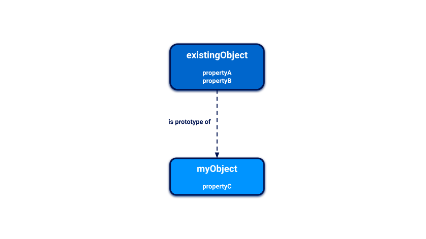
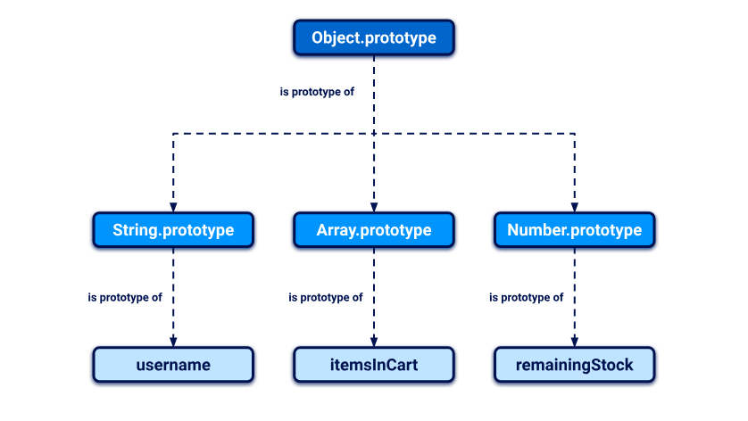

## Prototypes và Kế thừa trong JavaScript

JavaScript sử dụng mô hình kế thừa dựa trên prototype (prototypal inheritance), khác biệt đáng kể so với mô hình dựa trên class của nhiều ngôn ngữ khác. Dưới đây là phần giới thiệu cơ bản về cách hoạt động của mô hình này để bạn hiểu rõ hơn khi tìm hiểu về lỗ hổng prototype pollution.

## Đối tượng (Object) trong JavaScript là gì?
Một đối tượng trong JavaScript là tập hợp các cặp `key:value` gọi là "thuộc tính" (properties). Ví dụ:

```js
const user = {
    username: "wiener",
    userId: 01234,
    isAdmin: false
};
```

Bạn có thể truy cập các thuộc tính của đối tượng bằng cách sử dụng **dot notation** hoặc **bracket notation**:
```js
user.username    // "wiener"
user['userId']   // 01234
```

Ngoài dữ liệu, thuộc tính của một đối tượng cũng có thể chứa các hàm thực thi, gọi là phương thức (method):
```js
const user = {
    username: "wiener",
    userId: 01234,
    exampleMethod: function() {
        // do something
    }
};
```

## Prototype trong JavaScript là gì?
Mỗi đối tượng trong JavaScript được liên kết với một đối tượng khác gọi là prototype. JavaScript tự động gán cho các đối tượng mới một prototype mặc định. Ví dụ:

```js
let myObject = {};
Object.getPrototypeOf(myObject);    // Object.prototype

let myString = "";
Object.getPrototypeOf(myString);    // String.prototype
```

Mỗi đối tượng thừa hưởng tất cả thuộc tính của prototype được gán, trừ khi nó có một thuộc tính trùng key. Điều này giúp tái sử dụng thuộc tính và phương thức mà không cần sao chép chúng cho từng đối tượng mới.

Ví dụ, `String.prototype` có phương thức `toLowerCase()`, giúp tất cả chuỗi tự động có khả năng chuyển đổi thành chữ thường mà không cần định nghĩa lại.

## Cách hoạt động của kế thừa đối tượng
Khi bạn tham chiếu một thuộc tính của đối tượng, JavaScript sẽ:

Tìm kiếm thuộc tính trực tiếp trên đối tượng.
Nếu không tìm thấy, tiếp tục tìm trên prototype của đối tượng đó.
Ví dụ:

```js
let myObject = {};
console.log(myObject.toString()); // Kế thừa từ Object.prototype
```



## Chuỗi prototype (Prototype Chain)
Prototype của một đối tượng cũng là một đối tượng và có thể có prototype riêng. Chuỗi này kết thúc tại `Object.prototype`, mà `prototype` của nó là `null`.

Ví dụ:
```js
username.__proto__                        // String.prototype
username.__proto__.__proto__              // Object.prototype
username.__proto__.__proto__.__proto__    // null
```



## Thuộc tính `__proto__`
Mỗi đối tượng có thuộc tính đặc biệt `__proto__`, được sử dụng để truy cập prototype của nó. Thuộc tính này có thể:

- Đọc prototype và các thuộc tính của nó.
- Gán lại prototype mới nếu cần.
```js
username.__proto__
username['__proto__']

username.__proto__                        // String.prototype
username.__proto__.__proto__              // Object.prototype
username.__proto__.__proto__.__proto__    // null
```

Sửa đổi prototypes
Bạn có thể sửa đổi các prototype có sẵn, nhưng điều này thường được coi là thực hành xấu. Tuy nhiên, đôi khi việc này được sử dụng để thêm các phương thức tiện ích.

Ví dụ:

```js
String.prototype.removeWhitespace = function() {
    return this.trim();
};

let searchTerm = "  example ";
console.log(searchTerm.removeWhitespace()); // "example"
```


