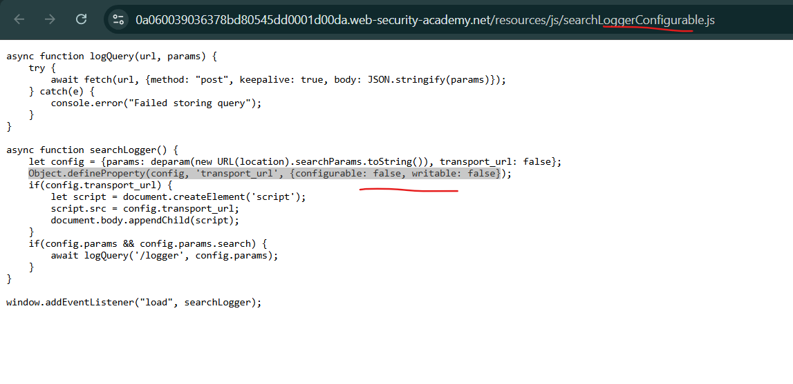

# Prototype pollution via browser APIs

Bạn có thể ngạc nhiên khi biết rằng có một số prototype pollution gadget phổ biến trong các API JavaScript thường được cung cấp trong trình duyệt. Trong phần này, chúng tôi sẽ chỉ cho bạn cách khai thác những lỗ hổng này cho DOM XSS, có khả năng vượt qua các biện pháp phòng ngừa prototype pollution bị lỗi do các nhà phát triển triển khai.

## Prototype pollution via fetch()

API Fetch cung cấp một cách đơn giản cho các nhà phát triển để kích hoạt các yêu cầu HTTP bằng JavaScript. Phương thức `fetch()` chấp nhận hai đối số:
- URL mà bạn muốn gửi yêu cầu.
- Một đối tượng tùy chọn cho phép bạn kiểm soát các phần của yêu cầu, chẳng hạn như phương thức, tiêu đề, tham số nội dung, v.v.

Sau đây là một ví dụ về cách bạn có thể gửi yêu cầu POST bằng cách sử dụng `fetch()`:
```js
fetch('https://normal-website.com/my-account/change-email', {
    method: 'POST',
    body: 'user=carlos&email=carlos%40ginandjuice.shop'
})
```

bạn có thể thấy, chúng ta đã định nghĩa rõ ràng các thuộc tính `method` và `body`, nhưng vẫn còn một số thuộc tính khác có thể có mà chúng ta chưa định nghĩa. Trong trường hợp này, nếu kẻ tấn công có thể tìm thấy nguồn phù hợp, chúng có khả năng làm ô nhiễm `Object.prototype` bằng thuộc tính `header` của riêng chúng. Sau đó, điều này có thể được kế thừa bởi đối tượng tùy chọn được truyền vào `fetch()` và sau đó được sử dụng để tạo yêu cầu.

Điều này có thể dẫn đến một số vấn đề. Ví dụ, đoạn mã sau có khả năng bị DOM XSS tấn công thông qua ô nhiễm nguyên mẫu:

```js
fetch('/my-products.json',{method:"GET"})
    .then((response) => response.json())
    .then((data) => {
        let username = data['x-username'];
        let message = document.querySelector('.message');
        if(username) {
            message.innerHTML = `My products. Logged in as <b>${username}</b>`;
        }
        let productList = document.querySelector('ul.products');
        for(let product of data) {
            let product = document.createElement('li');
            product.append(product.name);
            productList.append(product);
        }
    })
    .catch(console.error);
```

Để khai thác điều này, kẻ tấn công có thể làm ô nhiễm `Object.prototype` bằng thuộc tính `headers` chứa tiêu đề `x-username` độc ​​hại như sau:\
`?__proto__[headers][x-username]=`

Giả sử rằng ở phía máy chủ, tiêu đề này được dùng để đặt giá trị của thuộc tính `x-username` trong tệp JSON trả về. Trong mã phía máy khách dễ bị tấn công ở trên, điều này sau đó được gán cho biến `username`, sau đó được truyền vào bộ đệm innerHTML, dẫn đến DOM XSS.

## Prototype pollution via Object.defineProperty()

Các developer có một số hiểu biết về prototype pollution có thể thử chặn các gadget bằng cách sử dụng phương thức `Object.defineProperty()`. Điều này cho phép bạn thiết lập thuộc tính không thể định cấu hình và không thể ghi trực tiếp trên đối tượng bị ảnh hưởng như sau:
```js
Object.defineProperty(vulnerableObject, 'gadgetProperty', {
    configurable: false,
    writable: false
})
```

Thoạt đầu, điều này có vẻ như là một nỗ lực giảm thiểu hợp lý vì nó ngăn không cho đối tượng dễ bị tấn công thừa hưởng phiên bản độc hại của thuộc tính tiện ích thông qua chuỗi nguyên mẫu. Tuy nhiên, cách tiếp cận này về bản chất có nhiều sai sót.

Giống như phương thức `fetch()` mà chúng ta đã xem trước đó, `Object.defineProperty()` chấp nhận một đối tượng tùy chọn, được gọi là "`descriptor`". Bạn có thể thấy điều này trong ví dụ trên. Trong số những thứ khác, các nhà phát triển có thể sử dụng đối tượng mô tả này để đặt giá trị ban đầu cho thuộc tính đang được xác định. Tuy nhiên, nếu lý do duy nhất khiến họ định nghĩa thuộc tính này là để bảo vệ chống lại ô nhiễm nguyên mẫu, họ có thể không cần phải đặt giá trị.

Trong trường hợp này, kẻ tấn công có thể vượt qua được hàng phòng thủ này bằng cách làm ô nhiễm `Object.prototype` bằng một thuộc tính `value` độc hại. Nếu điều này được kế thừa bởi đối tượng mô tả được truyền cho `Object.defineProperty()`, thì giá trị do kẻ tấn công kiểm soát có thể được gán cho thuộc tính tiện ích.

---

## Ví dụ : Client-side prototype pollution via browser APIs

https://portswigger.net/web-security/prototype-pollution/client-side/browser-apis/lab-prototype-pollution-client-side-prototype-pollution-via-browser-apis

Tìm kiếm source tương tự



Riêng ở source code ta thấy dev đã dùng `Object.defineProperty` ở chế độ `{configurable: false, writable: false}` vậy nên `config` và `transport_url` không tiêm được, ta sẽ tiêm vào `value`

Payload: `/?__proto__[value]=data:,alert(1);`


