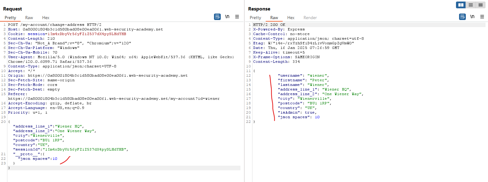
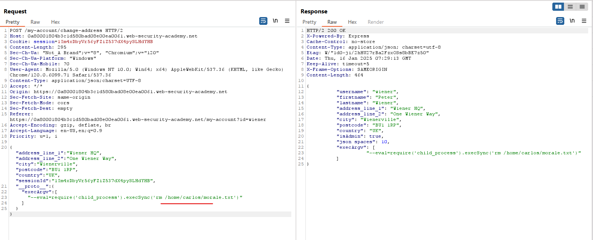
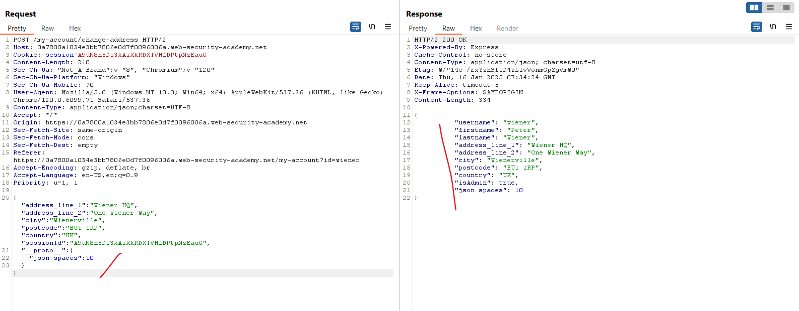
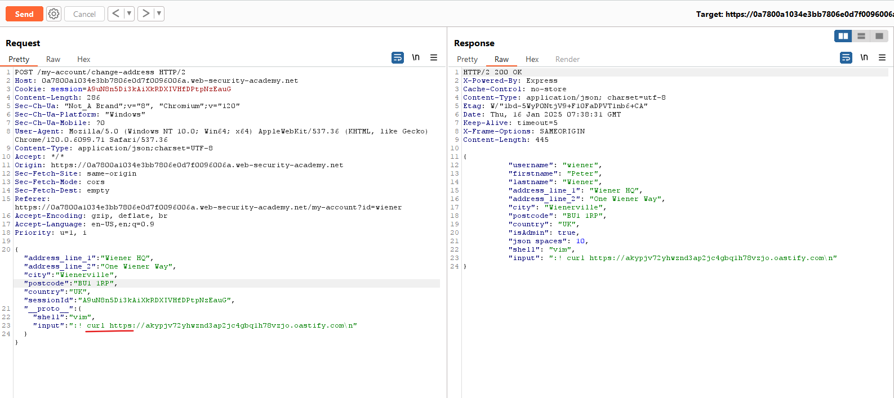
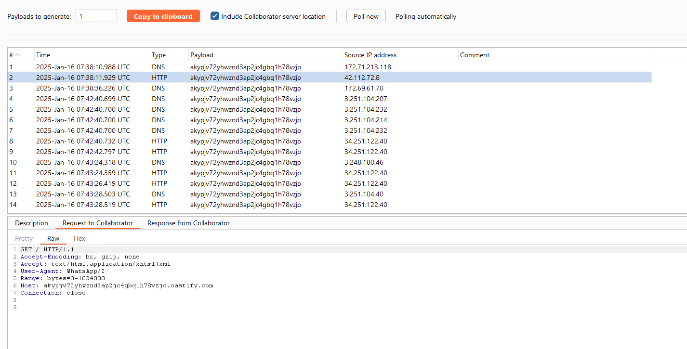
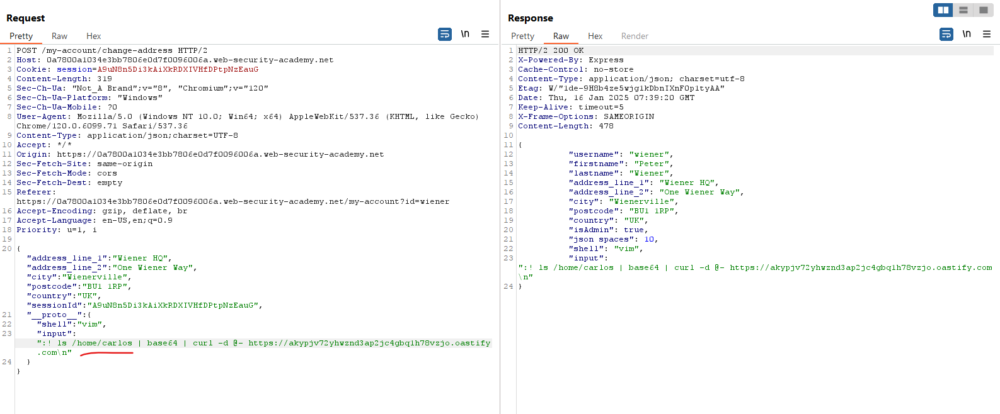
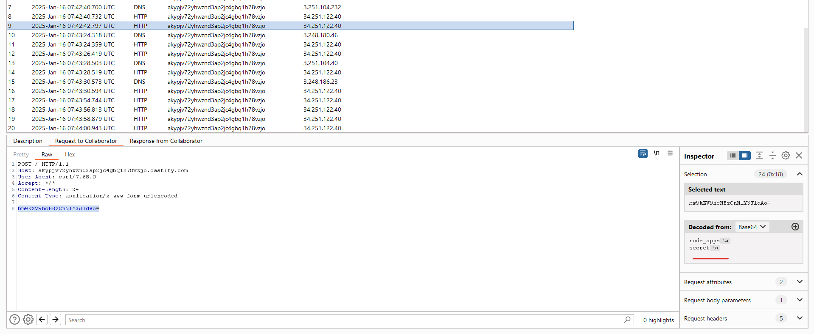
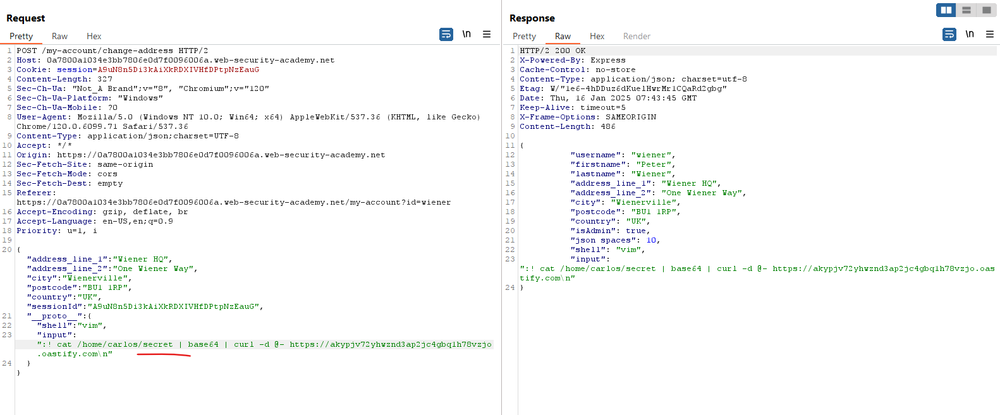
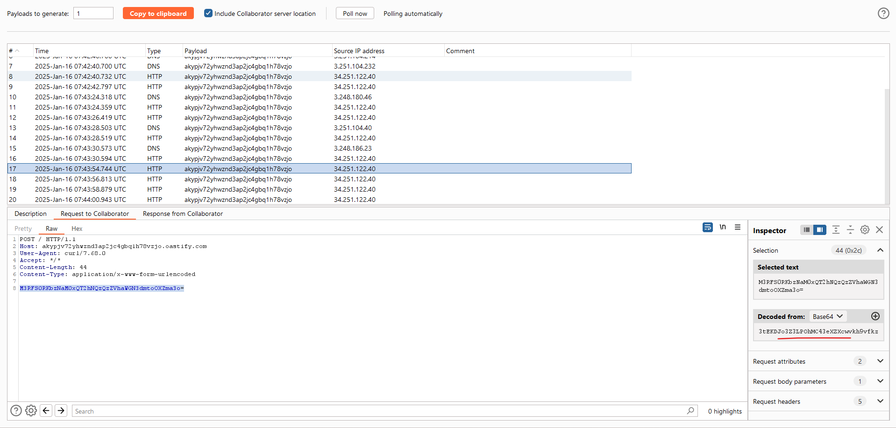

# Server-side prototype pollution

Protype pollution có thể dẫn đến RCE

## Tại sao prototype pollution ở server side khó phát hiện hơn?

Vì một số lý do, ô nhiễm nguyên mẫu phía máy chủ thường khó phát hiện hơn so với biến thể phía máy khách:

- No source code access: Code ở server sẽ không thể nhìn thấy nên đây là black box, khó để tìm sink
- Lack of developer tools: 
- The DoS problem: Việc gây ô nhiễm thành công các đối tượng trong môi trường phía máy chủ bằng các thuộc tính thực thường làm hỏng chức năng của ứng dụng hoặc khiến máy chủ ngừng hoạt động hoàn toàn. Ngay cả khi bạn xác định được lỗ hổng, việc khai thác lỗ hổng này cũng rất khó khăn khi về cơ bản bạn đã phá hỏng cả trang web trong quá trình này.
- Pollution persistence: Khi bạn làm ô nhiễm một nguyên mẫu phía máy chủ, thay đổi này sẽ tồn tại trong toàn bộ vòng đời của quy trình Node và bạn không có cách nào để thiết lập lại nó.

Trong các phần sau, chúng tôi sẽ đề cập đến một số kỹ thuật không phá hủy cho phép bạn kiểm tra ô nhiễm nguyên mẫu phía máy chủ một cách an toàn bất chấp những hạn chế này.

## Detecting server-side prototype pollution via polluted property reflection

Một cái bẫy dễ mắc phải đối với các nhà phát triển là quên hoặc bỏ qua thực tế rằng vòng lặp `for...in` của JavaScript sẽ lặp lại tất cả các thuộc tính có thể liệt kê của một đối tượng, bao gồm cả những thuộc tính mà đối tượng đó thừa hưởng thông qua chuỗi nguyên mẫu.

```js
const myObject = { a: 1, b: 2 };

// pollute the prototype with an arbitrary property
Object.prototype.foo = 'bar';

// confirm myObject doesn't have its own foo property
myObject.hasOwnProperty('foo'); // false

// list names of properties of myObject
for(const propertyKey in myObject){
    console.log(propertyKey);
}

// Output: a, b, foo
```

Điều này cũng áp dụng cho mảng, trong đó vòng lặp `for...in` trước tiên sẽ lặp qua từng chỉ mục, về cơ bản chỉ là một khóa thuộc tính số ẩn bên dưới, trước khi chuyển sang bất kỳ thuộc tính nào được kế thừa.

```js
const myArray = ['a','b'];

Object.prototype.foo = 'bar';

for(const arrayKey in myArray){
    console.log(arrayKey);
}

// Output: 0, 1, foo
```

Trong cả hai trường hợp, nếu sau đó ứng dụng bao gồm các thuộc tính được trả về trong phản hồi, thì đây có thể là một cách đơn giản để thăm dò ô nhiễm nguyên mẫu phía máy chủ.

Các yêu cầu `POST` hoặc `PUT` gửi dữ liệu JSON đến ứng dụng hoặc API là những ứng cử viên chính cho loại hành vi này vì máy chủ thường phản hồi bằng biểu diễn JSON của đối tượng mới hoặc đối tượng đã cập nhật. Trong trường hợp này, bạn có thể thử làm ô nhiễm `Object.prototype` toàn cục bằng một thuộc tính tùy ý như sau:

```js
POST /user/update HTTP/1.1
Host: vulnerable-website.com
...
{
    "user":"wiener",
    "firstName":"Peter",
    "lastName":"Wiener",
    "__proto__":{
        "foo":"bar"
    }
}
```

Nếu trang web có lỗ hổng, thuộc tính được tiêm của bạn sẽ xuất hiện trong đối tượng được cập nhật trong phản hồi:
```js
HTTP/1.1 200 OK
...
{
    "username":"wiener",
    "firstName":"Peter",
    "lastName":"Wiener",
    "foo":"bar"
}
```

Trong một số trường hợp hiếm hoi, trang web thậm chí có thể sử dụng các thuộc tính này để tạo HTML động, dẫn đến việc thuộc tính được đưa vào sẽ được hiển thị trong trình duyệt của bạn.

Khi bạn xác định được khả năng gây prototype pollution phía máy chủ, bạn có thể tìm kiếm các tiện ích tiềm năng để sử dụng cho mục đích khai thác. Bất kỳ tính năng nào liên quan đến việc `cập nhật dữ liệu người dùng` đều đáng để tìm hiểu vì chúng thường liên quan đến việc hợp nhất dữ liệu đầu vào vào một đối tượng hiện có đại diện cho người dùng trong ứng dụng. Nếu bạn có thể thêm các thuộc tính tùy ý cho người dùng của mình, điều này có khả năng dẫn đến một số lỗ hổng, bao gồm cả việc leo thang đặc quyền.

---

## Ví dụ: Privilege escalation via server-side prototype pollution

https://portswigger.net/web-security/prototype-pollution/server-side/lab-privilege-escalation-via-server-side-prototype-pollution

Tìm sink:

Với tính năng update thông tin, ta có thể tiêm prototype pollution vào đây:


Ở đây ta thấy `isAdmin` được set `false` nếu chỉnh sửa bình thường thì không thành công:


Nhưng có thể thành công qua proto:


Cuối cùng chỉ cần vào Admin panel xóa `Carlos`

---

## Phát hiện server-side prototype pollution mà không có được sự phản hồi lại (blind)

Hầu hết thời gian, ngay cả khi bạn làm ô nhiễm thành công một đối tượng nguyên mẫu phía máy chủ, bạn sẽ không thấy thuộc tính bị ảnh hưởng được phản ánh trong phản hồi. Do bạn không thể chỉ kiểm tra đối tượng trong bảng điều khiển nên điều này gây khó khăn khi xác định liệu lệnh tiêm của bạn có hoạt động hay không.

Một cách tiếp cận là thử tiêm các thuộc tính phù hợp với các tùy chọn cấu hình tiềm năng cho máy chủ. Sau đó, bạn có thể so sánh hành vi của máy chủ trước và sau khi tiêm để xem liệu thay đổi cấu hình này có hiệu lực hay không. Nếu vậy, đây là dấu hiệu rõ ràng cho thấy bạn đã tìm thấy thành công lỗ hổng ô nhiễm nguyên mẫu phía máy chủ.

Trong phần này, chúng ta sẽ xem xét các kỹ thuật sau:
- Ghi đè status code
- Ghi đè khoảng trắng JSON
- Ghi đè bộ charset

Tất cả các lần tiêm này đều không phá hủy, nhưng vẫn tạo ra sự thay đổi nhất quán và đặc biệt trong hành vi của máy chủ khi thành công. Bạn có thể sử dụng bất kỳ kỹ thuật nào được đề cập trong phần này để giải quyết bài lab đi kèm.

Đây chỉ là một số ít các kỹ thuật tiềm năng giúp bạn hình dung được những gì có thể thực hiện được. Để biết thêm thông tin chi tiết về kỹ thuật và hiểu biết sâu sắc về cách PortSwigger Research có thể phát triển các kỹ thuật này, hãy xem báo cáo kèm theo có tên `Server-side prototype pollution: Black-box detection without DoS của Gareth Heyes`.

### Status code override

Các framework JavaScript phía máy chủ như `Express` cho phép các nhà phát triển đặt trạng thái phản hồi HTTP tùy chỉnh. Trong trường hợp có lỗi, máy chủ JavaScript có thể đưa ra phản hồi HTTP chung nhưng bao gồm một đối tượng lỗi ở định dạng `JSON` trong nội dung. Đây là một cách cung cấp thêm thông tin chi tiết về lý do xảy ra lỗi, điều này có thể không rõ ràng từ trạng thái HTTP mặc định.

Mặc dù có phần gây hiểu lầm, nhưng việc nhận được phản hồi 200 OK lại khá phổ biến, trong khi nội dung phản hồi lại chứa một đối tượng lỗi có trạng thái khác.

```js
HTTP/1.1 200 OK
...
{
    "error": {
        "success": false,
        "status": 401,
        "message": "You do not have permission to access this resource."
    }
}
```

Mô-đun `http-errors` của Node chứa hàm sau để tạo loại phản hồi lỗi này:

```js
function createError () {
    //...
    if (type === 'object' && arg instanceof Error) {
        err = arg
        status = err.status || err.statusCode || status
    } else if (type === 'number' && i === 0) {
    //...
    if (typeof status !== 'number' ||
    (!statuses.message[status] && (status < 400 || status >= 600))) {
        status = 500
    }
    //...
```

Đầu tiên nó gán biến `status` bằng cách đọc thuộc tính `status` hoặc `statusCode` từ đối tượng được truyền vào hàm. Nếu nhà phát triển trang web chưa thiết lập rõ ràng thuộc tính `status` cho lỗi, bạn có thể sử dụng thuộc tính này để thăm dò ô nhiễm nguyên mẫu như sau:

- Tìm cách kích hoạt phản hồi lỗi và ghi lại mã trạng thái mặc định.
- Hãy thử làm ô nhiễm nguyên mẫu bằng thuộc tính `status` của riêng bạn. Hãy chắc chắn sử dụng status code tối nghĩa mà không có khả năng được cấp vì bất kỳ lý do nào khác.
- Kích hoạt lại phản hồi lỗi và kiểm tra xem bạn đã ghi đè thành công mã trạng thái hay chưa.

Note: Bạn phải chọn mã trạng thái trong phạm vi `400-599`. Nếu không, Node sẽ mặc định là trạng thái 500 bất kể thế nào, như bạn có thể thấy từ dòng được tô sáng thứ hai, do đó bạn sẽ không biết liệu mình có làm ô nhiễm nguyên mẫu hay không.

### JSON spaces override

Framework `Express` cung cấp tùy chọn khoảng trắng `json` cho phép bạn cấu hình số khoảng trắng được sử dụng để thụt lề bất kỳ dữ liệu JSON nào trong phản hồi. Trong nhiều trường hợp, các nhà phát triển để thuộc tính này không xác định vì họ hài lòng với giá trị mặc định, khiến nó dễ bị ô nhiễm thông qua chuỗi nguyên mẫu.

Nếu bạn có quyền truy cập vào bất kỳ loại phản hồi JSON nào, bạn có thể thử làm ô nhiễm nguyên mẫu bằng thuộc tính khoảng trắng json của riêng bạn, sau đó đưa ra lại yêu cầu có liên quan để xem khoảng thụt lề trong JSON có tăng lên tương ứng hay không. Bạn có thể thực hiện các bước tương tự để xóa thụt lề nhằm xác nhận lỗ hổng.

Đây là một kỹ thuật đặc biệt hữu ích vì nó không phụ thuộc vào việc phản ánh một thuộc tính cụ thể nào. Nó cũng cực kỳ an toàn vì bạn có thể bật hoặc tắt chế độ ô nhiễm chỉ bằng cách đặt lại thuộc tính về cùng giá trị mặc định.

Mặc dù lỗi ô nhiễm nguyên mẫu đã được khắc phục trong Express 4.17.4, các trang web chưa nâng cấp vẫn có thể bị tấn công.

Note: Khi thử kỹ thuật này trong Burp, hãy nhớ chuyển sang tab `Raw` của trình soạn thảo tin nhắn. Nếu không, bạn sẽ không thể thấy sự thay đổi thụt lề vì chế độ xem đẹp mắt mặc định sẽ chuẩn hóa điều này.

### Charset override

Máy chủ Express thường triển khai các mô-đun "phần mềm trung gian" cho phép xử lý trước các yêu cầu trước khi chúng được chuyển đến hàm xử lý thích hợp. Ví dụ, mô-đun `body-parser` thường được sử dụng để phân tích nội dung của các yêu cầu đến nhằm tạo ra đối tượng `req.body`. Phần này chứa một tiện ích khác mà bạn có thể sử dụng để thăm dò ô nhiễm nguyên mẫu phía máy chủ.

Lưu ý rằng đoạn mã sau truyền một đối tượng tùy chọn vào hàm `read()`, được sử dụng để đọc nội dung yêu cầu để phân tích cú pháp. Một trong những tùy chọn này, mã hóa, xác định mã hóa ký tự nào sẽ sử dụng. Mã hóa này có thể được lấy từ chính yêu cầu thông qua lệnh gọi hàm `getCharset(req)` hoặc mặc định là UTF-8.

```js
var charset = getCharset(req) or 'utf-8'

function getCharset (req) {
    try {
        return (contentType.parse(req).parameters.charset || '').toLowerCase()
    } catch (e) {
        return undefined
    }
}

read(req, res, next, parse, debug, {
    encoding: charset,
    inflate: inflate,
    limit: limit,
    verify: verify
})
```

Nếu bạn xem xét kỹ hàm `getCharset()`, có vẻ như các nhà phát triển đã dự đoán rằng tiêu đề `Content-Type` có thể không chứa thuộc tính `charset` rõ ràng, vì vậy họ đã triển khai một số logic để chuyển về chuỗi rỗng trong trường hợp này. Điều quan trọng là, điều này có nghĩa là có thể kiểm soát được thông qua ô nhiễm nguyên mẫu.

Nếu bạn có thể tìm thấy một đối tượng có thuộc tính hiển thị trong phản hồi, bạn có thể sử dụng đối tượng này để thăm dò nguồn. Trong ví dụ sau, chúng ta sẽ sử dụng mã hóa `UTF-7` và nguồn `JSON`. 

1. Thêm một chuỗi mã hóa `UTF-7` tùy ý vào một thuộc tính được phản ánh trong phản hồi. Ví dụ, `foo` trong `UTF-7` là `+AGYAbwBv-`.

2. Gửi yêu cầu. Theo mặc định, máy chủ sẽ không sử dụng mã hóa UTF-7, do đó chuỗi này sẽ xuất hiện trong phản hồi dưới dạng đã mã hóa.

3. Hãy thử làm ô nhiễm nguyên mẫu bằng thuộc tính content-type chỉ định rõ ràng bộ ký tự UTF-7:

```json
{
    "sessionId":"0123456789",
    "username":"wiener",
    "role":"default",
    "__proto__":{
        "content-type": "application/json; charset=utf-7"
    }
}
```

4. Lặp lại yêu cầu đầu tiên. Nếu bạn đã làm ô nhiễm thành công nguyên mẫu, chuỗi UTF-7 bây giờ sẽ được giải mã trong phản hồi:

```json
{
    "sessionId":"0123456789",
    "username":"wiener",
    "role":"foo"
}
```

Do lỗi trong mô-đun `_http_incoming` của Node, tính năng này vẫn hoạt động ngay cả khi tiêu đề `Content-Type` thực tế của yêu cầu bao gồm thuộc tính `charset` của riêng nó. Để tránh ghi đè thuộc tính khi yêu cầu chứa tiêu đề trùng lặp, hàm `_addHeaderLine()` kiểm tra xem có thuộc tính nào tồn tại với cùng khóa hay không trước khi chuyển thuộc tính sang đối tượng `IncomingMessage`

```js
IncomingMessage.prototype._addHeaderLine = _addHeaderLine;
function _addHeaderLine(field, value, dest) {
    // ...
    } else if (dest[field] === undefined) {
        // Drop duplicates
        dest[field] = value;
    }
}
```
 
 Nếu có, tiêu đề đang được xử lý sẽ bị loại bỏ. Do cách thực hiện này, kiểm tra này (có lẽ là vô tình) bao gồm các thuộc tính được thừa hưởng thông qua chuỗi nguyên mẫu. Điều này có nghĩa là nếu chúng ta làm ô nhiễm nguyên mẫu bằng thuộc tính `content-type` của riêng mình, thuộc tính biểu thị tiêu đề `Content-Type` thực từ yêu cầu sẽ bị loại bỏ tại thời điểm này, cùng với giá trị mong muốn bắt nguồn từ tiêu đề.

---

## Ví dụ: Detecting server-side prototype pollution without polluted property reflection

https://portswigger.net/web-security/prototype-pollution/server-side/lab-detecting-server-side-prototype-pollution-without-polluted-property-reflection

Sau khi đăng nhập và update thông tin:

Request bình thường:


Tiêm prototype nhưng trong phản hồi không reflect:


Xóa 1 số dòng để request lỗi, thường nó sẽ trả về 500 kèm lỗi nhưng đây lỗi lại đã được đổi:


---

## Scanning for server-side prototype pollution sources

## Bypassing input filters for server-side prototype pollution

Các trang web thường cố gắng ngăn chặn hoặc vá các lỗ hổng ô nhiễm nguyên mẫu bằng cách lọc các khóa đáng ngờ như `__proto__`. Phương pháp vệ sinh chính này không phải là giải pháp lâu dài mạnh mẽ vì có một số cách có thể bỏ qua. Ví dụ, kẻ tấn công có thể:
- Làm tối nghĩa các từ khóa bị cấm để chúng không bị bỏ sót trong quá trình vệ sinh.
- Truy cập nguyên mẫu thông qua thuộc tính constructor thay vì `__proto__`.

Các ứng dụng Node cũng có thể xóa hoặc vô hiệu hóa `__proto__` hoàn toàn bằng cách sử dụng các cờ dòng lệnh `--disable-proto=delete` hoặc `--disable-proto=throw`. Tuy nhiên, điều này cũng có thể được bỏ qua bằng cách sử dụng kỹ thuật xây dựng.

--- 

## Ví dụ: Bypassing flawed input filters for server-side prototype pollution

https://portswigger.net/web-security/prototype-pollution/server-side/lab-bypassing-flawed-input-filters-for-server-side-prototype-pollution

Tương tự ta thử nhưng không thành công:


Ta đổi thành constructor:

```json
"constructor": {
    "prototype": {
        "json spaces":10
    }
}
```


Từ đây ta đổi `isAdmin` thành `true`:


---

## Remote code execution via server-side prototype pollution

Trong khi ô nhiễm nguyên mẫu phía client thường khiến trang web dễ bị tấn công DOM XSS thì ô nhiễm nguyên mẫu phía máy chủ có khả năng dẫn đến thực thi mã từ xa (RCE). Trong phần này, bạn sẽ học cách xác định các trường hợp có thể thực hiện được điều này và cách khai thác một số vectơ tiềm năng trong các ứng dụng Node.

### Identifying a vulnerable request

Có một số bộ xử lý thực thi lệnh tiềm ẩn trong Node, nhiều trong số đó xảy ra trong mô-đun `child_process`. Những lệnh này thường được gọi bởi một yêu cầu xảy ra không đồng bộ với yêu cầu mà bạn có thể dùng để làm ô nhiễm nguyên mẫu ngay từ đầu. Do đó, cách tốt nhất để xác định các yêu cầu này là làm ô nhiễm nguyên mẫu bằng một tải trọng kích hoạt tương tác với Burp Collaborator khi được gọi.

Biến môi trường `NODE_OPTIONS` cho phép bạn xác định chuỗi đối số dòng lệnh sẽ được sử dụng theo mặc định bất cứ khi nào bạn bắt đầu một tiến trình Node mới. Vì đây cũng là một thuộc tính trên đối tượng `env`, bạn có thể kiểm soát thuộc tính này thông qua ô nhiễm nguyên mẫu nếu nó chưa được xác định.

Một số chức năng của Node để tạo tiến trình con mới chấp nhận thuộc tính `shell` tùy chọn, cho phép các nhà phát triển thiết lập một shell cụ thể, chẳng hạn như bash, để chạy lệnh. Bằng cách kết hợp điều này với thuộc tính `NODE_OPTIONS` độc hại, bạn có thể làm ô nhiễm nguyên mẫu theo cách gây ra tương tác với Burp Collaborator bất cứ khi nào một quy trình Node mới được tạo:

```json
"__proto__": {
    "shell":"node",
    "NODE_OPTIONS":"--inspect=YOUR-COLLABORATOR-ID.oastify.com\"\".oastify\"\".com"
}
```

Theo cách này, bạn có thể dễ dàng xác định thời điểm yêu cầu tạo ra một tiến trình con mới với các đối số dòng lệnh có thể kiểm soát được thông qua ô nhiễm nguyên mẫu.

Dấu ngoặc kép thoát trong tên máy chủ không thực sự cần thiết. Tuy nhiên, điều này có thể giúp giảm các kết quả dương tính giả bằng cách làm tối nghĩa tên máy chủ để tránh WAF và các hệ thống khác thu thập tên máy chủ.

### Remote code execution via child_process.fork()

Các phương thức như `child_process.spawn()` và `child_process.fork()` cho phép các nhà phát triển tạo các tiến trình con Node mới. Phương thức `fork()` chấp nhận một đối tượng tùy chọn trong đó một trong các tùy chọn tiềm năng là thuộc tính `execArgv`. Đây là một mảng các chuỗi chứa các đối số dòng lệnh cần được sử dụng khi tạo ra tiến trình con. Nếu các nhà phát triển không xác định, điều này cũng có nghĩa là nó có thể được kiểm soát thông qua ô nhiễm nguyên mẫu.

Vì tiện ích này cho phép bạn trực tiếp kiểm soát các đối số dòng lệnh nên bạn có thể truy cập vào một số hướng tấn công mà không thể thực hiện được khi sử dụng `NODE_OPTIONS`. Đặc biệt quan tâm là đối số `--eval`, cho phép bạn truyền vào JavaScript tùy ý sẽ được thực thi bởi tiến trình con. Điều này có thể khá mạnh mẽ, thậm chí cho phép bạn tải các mô-đun bổ sung vào môi trường:

```json
"execArgv": [
    "--eval=require('<module>')"
]
```

Ngoài `fork()`, mô-đun `child_process` còn chứa phương thức `execSync()`, thực thi một chuỗi tùy ý như một lệnh hệ thống. Bằng cách kết nối các bộ lọc JavaScript và lệnh này, bạn có thể tăng cường khả năng gây ô nhiễm nguyên mẫu để có được khả năng RCE đầy đủ trên máy chủ.

---

### Ví dụ: Remote code execution via server-side prototype pollution

https://portswigger.net/web-security/prototype-pollution/server-side/lab-remote-code-execution-via-server-side-prototype-pollution

Đầu tiên ta sẽ tìm sink, tương tự bài trước ta thử được:



Bây giờ ta test khả năng inject thành công thực thi lệnh bằng cách gửi gói tin ra ngoài và bắt thành công: (phải reload lại trang job)


Cuối cùng là rm report đã nhận được:



---

### Remote code execution via child_process.execSync()

Trong ví dụ trước, chúng tôi đã tự chèn `child_process.execSync()` sink thông qua đối số dòng lệnh `--eval`. Trong một số trường hợp, ứng dụng có thể tự gọi phương thức này để thực thi các lệnh hệ thống.

Giống như `fork()`, phương thức `execSync()` cũng chấp nhận đối tượng tùy chọn, có thể bị ô nhiễm thông qua chuỗi nguyên mẫu. Mặc dù điều này không chấp nhận thuộc tính `execArgv`, bạn vẫn có thể đưa lệnh hệ thống vào một tiến trình con đang chạy bằng cách đồng thời làm ô nhiễm cả thuộc tính `shell` và `input`:
- Tùy chọn đầu vào chỉ là một chuỗi được truyền vào luồng `stdin` của tiến trình con và được thực thi như một lệnh hệ thống bởi `execSync()`. Vì có những tùy chọn khác để cung cấp lệnh, chẳng hạn như chỉ cần truyền lệnh làm đối số cho hàm, nên thuộc tính đầu vào có thể được để không xác định.
- Tùy chọn `shell` cho phép các nhà phát triển khai báo một `shell` cụ thể mà họ muốn lệnh chạy. Theo mặc định, `execSync()` sử dụng `shell` mặc định của hệ thống để chạy lệnh, vì vậy điều này cũng có thể được để không xác định.

Bằng cách làm ô nhiễm cả hai thuộc tính này, bạn có thể ghi đè lệnh mà các nhà phát triển ứng dụng dự định thực hiện và thay vào đó chạy lệnh độc hại trong shell mà bạn chọn. Lưu ý rằng có một vài cảnh báo đối với điều này:

- Tùy chọn `shell` chỉ chấp nhận tên của tệp thực thi shell và không cho phép bạn đặt bất kỳ đối số dòng lệnh bổ sung nào.
- Shell luôn được thực thi với tham số `-c`, mà hầu hết các `shell` sử dụng để cho phép bạn truyền lệnh dưới dạng chuỗi. Tuy nhiên, việc đặt cờ `-c` trong Node thay vào đó sẽ chạy kiểm tra cú pháp trên tập lệnh được cung cấp, điều này cũng ngăn không cho tập lệnh thực thi. Do đó, mặc dù có giải pháp khắc phục vấn đề này, nhưng nhìn chung vẫn rất khó để sử dụng chính Node làm lớp vỏ cho cuộc tấn công.
- Vì thuộc tính đầu vào chứa dữ liệu của bạn được truyền qua `stdin` nên `shell` bạn chọn phải chấp nhận lệnh từ `stdin`.

Mặc dù chúng không thực sự có mục đích là shell, nhưng trình soạn thảo văn bản Vim và ex đáp ứng đáng tin cậy tất cả các tiêu chí này. Nếu một trong hai trình soạn thảo này được cài đặt trên máy chủ, điều này sẽ tạo ra một vectơ tiềm năng cho RCE:

```json
"shell":"vim",
"input":":! <command>\n"
```

NOTE: Vim có một lời nhắc tương tác và mong đợi người dùng nhấn Enter để chạy lệnh được cung cấp. Do đó, bạn cần mô phỏng điều này bằng cách thêm ký tự xuống dòng (`\n`) vào cuối payload của bạn, như được hiển thị trong ví dụ trên.


Một hạn chế nữa của kỹ thuật này là một số công cụ mà bạn có thể muốn sử dụng để khai thác cũng không đọc dữ liệu từ `stdin` theo mặc định. Tuy nhiên, có một số cách đơn giản để giải quyết vấn đề này. Ví dụ, trong trường hợp `curl`, bạn có thể đọc `stdin` và gửi nội dung dưới dạng phần thân của yêu cầu POST bằng cách sử dụng đối số `-d @-`. 

Trong những trường hợp khác, bạn có thể sử dụng `xargs` để chuyển đổi `stdin` thành danh sách các đối số có thể truyền vào lệnh.


----

### ví dụ: Exfiltrating sensitive data via server-side prototype pollution

https://portswigger.net/web-security/prototype-pollution/server-side/lab-exfiltrating-sensitive-data-via-server-side-prototype-pollution

Check sink:



Chạy curl mà reload lại page job để bắt request:





Liệt kê file:





Đọc secret:






