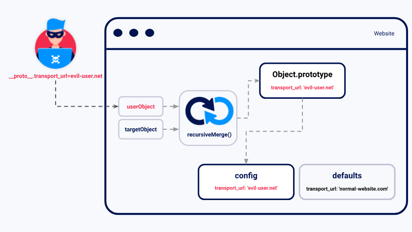

## Prototype Pollution là gì?
Prototype Pollution là một lỗ hổng trong JavaScript, cho phép kẻ tấn công thêm các thuộc tính tùy ý vào các prototype của đối tượng toàn cục. Những thuộc tính này có thể được các đối tượng do người dùng định nghĩa kế thừa.



Dù prototype pollution thường không phải là một lỗ hổng có thể khai thác độc lập, nhưng nó cho phép kẻ tấn công kiểm soát các thuộc tính của đối tượng mà bình thường sẽ không thể truy cập được. Nếu ứng dụng xử lý các thuộc tính do kẻ tấn công kiểm soát theo cách không an toàn, lỗ hổng này có thể được kết hợp với các lỗ hổng khác.

- Trong JavaScript phía client, điều này thường dẫn đến DOM XSS.
- Trong JavaScript phía server, prototype pollution có thể dẫn đến remote code execution (RCE).

## Nguyên nhân lỗ hổng Prototype Pollution
Lỗ hổng này thường xuất hiện khi một hàm JavaScript thực hiện việc merge đệ quy (`recursive merge`) một đối tượng có chứa các thuộc tính do người dùng kiểm soát vào một đối tượng hiện có mà không kiểm tra hoặc lọc các key. Điều này cho phép kẻ tấn công chèn thuộc tính với key đặc biệt như `__proto__`, cùng với các thuộc tính lồng ghép tùy ý.

Vì `__proto__` có ý nghĩa đặc biệt trong JavaScript, thao tác merge này có thể gán các thuộc tính lồng ghép vào prototype của đối tượng thay vì chính đối tượng đó. Do đó, kẻ tấn công có thể "nhiễm độc" prototype bằng các thuộc tính chứa giá trị độc hại, dẫn đến việc ứng dụng sử dụng chúng theo cách nguy hiểm.

Lỗ hổng này có thể xảy ra với bất kỳ prototype nào, nhưng thường gặp nhất ở prototype toàn cục mặc định `Object.prototype`.

Khai thác **Prototype Pollution** cần những gì?
- Nguồn gây ô nhiễm (Source):
Đầu vào cho phép kẻ tấn công tiêm các thuộc tính tùy ý vào các prototype.

- Sink:
Hàm JavaScript hoặc DOM element nào đó có thể dẫn đến thực thi mã tùy ý.

- Gadget có thể khai thác:
Thuộc tính được truyền vào sink mà không được lọc hoặc kiểm tra hợp lệ.

## Prototype pollution sources
Prototype pollution sources là bất kỳ đầu vào nào mà người dùng có thể kiểm soát và cho phép thêm các thuộc tính tùy ý vào prototype của đối tượng. Các nguồn phổ biến bao gồm:

- URL thông qua query string hoặc fragment string (hash)
- Dữ liệu JSON
- Web messages

### Prototype Pollution qua URL
Xem xét URL sau, nơi query string được kẻ tấn công tạo:
```js
https://vulnerable-website.com/?__proto__[evilProperty]=payload
```

Khi phân tích query string thành các cặp `key:value`, trình phân tích URL có thể coi `__proto__` như một chuỗi ký tự tùy ý. Tuy nhiên, nếu các key và value này được merge vào một đối tượng hiện có, kết quả có thể như sau:

```js
{
    existingProperty1: 'foo',
    existingProperty2: 'bar',
    __proto__: {
        evilProperty: 'payload'
    }
}
```
Nhưng thực tế, phép gán đệ quy có thể thực hiện một câu lệnh như sau:
```js
targetObject.__proto__.evilProperty = 'payload';
```

Khi đó, JavaScript coi `__proto__` là getter cho prototype, khiến `evilProperty` được gán vào prototype của đối tượng thay vì chính đối tượng đó.

Nếu đối tượng mục tiêu sử dụng prototype mặc định `Object.prototype`, mọi đối tượng trong runtime JavaScript sẽ kế thừa thuộc tính `evilProperty`, trừ khi chúng đã có thuộc tính trùng key.

### Prototype Pollution qua JSON Input
Dữ liệu đầu vào do người dùng kiểm soát thường được tạo từ chuỗi JSON thông qua `JSON.parse()`, trong đó mọi key, kể cả `__proto__`, đều được xử lý như chuỗi ký tự tùy ý.

Ví dụ, kẻ tấn công có thể chèn JSON độc hại sau:
```js
{
    "__proto__": {
        "evilProperty": "payload"
    }
}
```

Khi được chuyển thành đối tượng JavaScript qua `JSON.parse()`, kết quả sẽ có thuộc tính với key `__proto__`:
```js
const objectFromJson = JSON.parse('{"__proto__": {"evilProperty": "payload"}}');
objectFromJson.hasOwnProperty('__proto__'); // true
```

Nếu đối tượng được tạo qua `JSON.parse()` được merge vào một đối tượng hiện có mà không lọc key, sẽ xảy ra `prototype pollution`, giống như trường hợp với URL.

## Prototype Pollution Sinks
`Prototype pollution sink` là bất kỳ hàm JavaScript hoặc phần tử DOM nào mà bạn có thể truy cập thông qua prototype pollution, cho phép bạn thực thi JavaScript tùy ý hoặc lệnh hệ thống.

Chúng ta đã đề cập chi tiết về một số sink phía client trong chủ đề về DOM XSS.

Prototype pollution cho phép bạn kiểm soát các thuộc tính vốn không thể truy cập được, từ đó có khả năng khai thác nhiều sink bổ sung trong ứng dụng mục tiêu. Các nhà phát triển không quen thuộc với prototype pollution có thể cho rằng những thuộc tính này không thể bị người dùng kiểm soát, dẫn đến việc lọc và xử lý dữ liệu đầu vào không đầy đủ.


## Prototype Pollution Gadgets
Gadget là công cụ biến lỗ hổng prototype pollution thành một khai thác thực tế. Gadget là bất kỳ thuộc tính nào thỏa mãn:

- Được ứng dụng sử dụng một cách không an toàn, chẳng hạn truyền vào một sink mà không qua lọc hoặc kiểm tra.
- Có thể bị kẻ tấn công kiểm soát thông qua prototype pollution, tức là đối tượng phải có khả năng kế thừa phiên bản độc hại của thuộc tính được thêm vào prototype bởi kẻ tấn công.

Một thuộc tính không thể trở thành gadget nếu nó được định nghĩa trực tiếp trên đối tượng. Khi đó, phiên bản thuộc tính của đối tượng sẽ ưu tiên hơn phiên bản độc hại được thêm vào prototype. Các trang web bảo mật cao có thể thiết lập prototype của đối tượng là null, ngăn chặn việc kế thừa bất kỳ thuộc tính nào.


